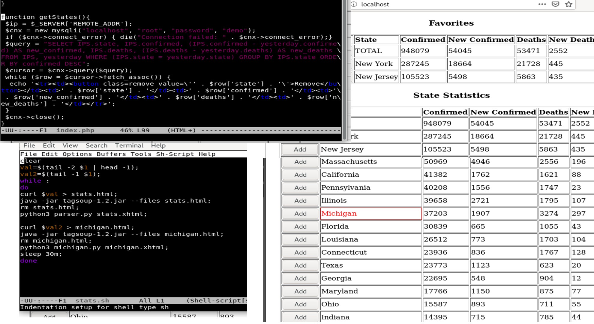

# COVID19-Stat-Tracker
Uses PHP, Python, SQL, Bash to scrape data from web and display own page using LAMP Stack. Coded entirely and tediously in GNU EMACS.

Use `$ stats.sh sources.txt` to begin server

